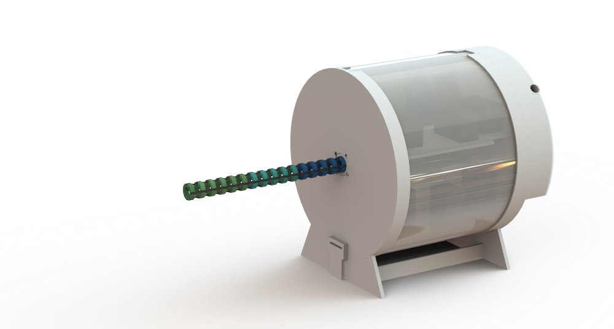

# Endo-Continuum-Robot
Endo is an open-source continuum robot, designed to be accessible, easy to use, and customisable.

## Prerequisites
- SolidWorks 2021-22 or above
- Arduino IDE

## License
This work is published under the GNU General Purpose License v3.0. For more information see the [LICENSE](https://github.com/OpenSourceMedicalRobots/Endo-Continuum-Robot/blob/master/LICENSE) file.

## Acknowledgements
